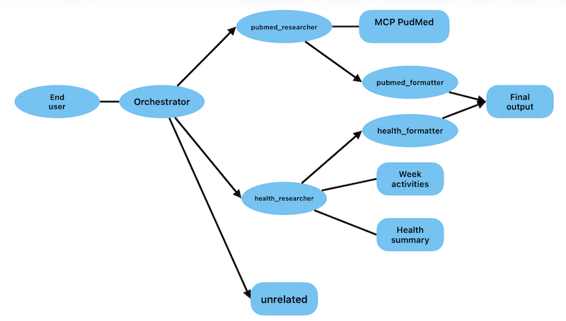

## Project Overview - Personal health coach

NOTE: This is **my submssion** for the [AI Agents: Intensive Vibe Coding Capstone Project](https://www.kaggle.com/competitions/vibecoding-agents-capstone-project/overview).

This project contains the core logic of the “Agent Personal Health” agent, a multi-agent system designed to assist users in the areas of personal health, fitness, well-being, nutrition, and physical activity tracking. (e.g. daily steps, heart rate, sleep metrics, personal workout summaries, weight/height). The agent is built using Google Antigravity and Google Agent Development Kit (ADK) and follows a modular architecture.


## Problem statement

Recently, we have noticed that AI is becoming increasingly prevalent in sports (Fitbit, Strava, etc.), as well as in wellness and mindfulness (sleep duration, resting heart rate, heart rate variability, etc.).

The idea behind this concept is to determine whether an agent can replace a professional, for example, in analysing sleep, weekly activities, resting heart rate, and heart rate variability. Based on historical data, the person’s age, and gender, the agent should be able to provide recommendations. In our study, we are focusing exclusively on healthy individuals. Therefore, we will not take nutritional aspects or activity planning into account.

To make our case study a little more interactive, we’re adding the ability for users to ask the agent general medical questions, such as: “Find me some medical articles on dietary supplements.”
We’re describing only the back-end portion. The front-end portion is not described.

## Solution statement

AI agents provide the ideal architecture for personalised health and fitness analysis, for several compelling reasons:
Multi-agent systems allow us to create experts specialised in specific fields. A coaching agent, for example, focuses on exercise science, training progression, and sleep quality. This specialization results in higher-quality and more precise recommendations than those provided by a single generalist agent. Another generalist agent could provide insights on general health or sports-related health.


## Architecture



**Orchestrator**

This is the classifier for a personal coach assistant. This agent read the user's query and decide whether it is a general knowledge question (requesting research papers, publications, literature databases), or a health question related to personal health (fitness, wellness, nutrition, exercices tracking).

**General knowledge: `pubmd_researcher`**

This agent queries the MCP server for any questions regarding general health knowledge and searches for medical publications

**Health and wellness coach: `health_researcher`**

This is the expert health and wellness coach. It can answer the user's question by fetching their actual personal data using the resting health summary and exercise activities tools. It can use the tools when the query involves sleep, steps, heart rate, weight, height, or specific workout sessions (e.g. bike rides, muscle building).

**Output formatter: `pubmed_formatter`**

The Agent `pubmed_formatter` construct a structured response with a short label describing the scientific field (e.g. 'Genetics', 'Virology', 'Oncology', 'Cardiology', 'Immunology').


**Output formatter: `health_formatter`**

The Agent `health_formatter` construct a personalized coaching response. The agent is not a licensed medical professional. It always recommend consulting a qualified healthcare provider.

**Tools**

The `get_resting_health_summary` function retrieves the daily metrics from the user's resting health summary. This includes weight, height, age, resting heart rate, heart rate variability (HRV), daily steps, and detailed sleep phase durations (REM, deep, light sleep, total sleep minutes, bed time, wake up time). The output is a list of dictionaries, where each dictionary represents one day of resting health metrics.

The `get_exercise_activities` function retrieves user's logged physical exercises and workout activities. This includes exercise name (e.g. Outdoor Bike, muscle building), activity date, duration (minutes), average heart rate, elevation gain, distance, speed, and calories burned. The ouput is a list of dictionaries, where each dictionary represents one logged exercise session.

The `pubmed_mcp_toolset` class connect to the MCP server. The transport type is STDIO.

The `user-summary` and `exercise-week` skills are intended for validation input CSV files.

**MCP with `https://github.com/cyanheads/pubmed-mcp-server`**

To communicate with the MCP server, we added the following configuration to the file ~/.gemini/config/mcp_config.json).
```
"mcpServers": {
    "pubmed-mcp-server": {
      "type": "stdio",
      "command": "npx",
      "args": ["-y", "@cyanheads/pubmed-mcp-server@latest"],
      "env": {
        "MCP_TRANSPORT_TYPE": "stdio",
        "MCP_LOG_LEVEL": "info",
        "NCBI_API_KEY": "000000000000000000000000000000"
      }
    }
  }
```

This solution works well and allows you to run complex queries.

**MCP server & client**

-The other option is to set up an MCP server to connect to PubMed. We created a directory named “mcp” and added the file “pubmed_server.py,” an interface for the PubMed server. We use BioPyton's `Entrez` module for the connection.
We use `server.py` as the MCP server, and `client.py` is a client for validating requests.

### User prompt

**Prompt health coach**

- What’s my average heart rate in the past 30 days?
- What is my max sleep duration in last week?
- How many minutes have I exercised in the past 10 days?
- How can I improve my sleep?
- Are there any anomalies in my health?
- How can I get stronger without gaining mass?

**Prompt general knowledge**

- I would like some medical advice on the recommended amount of sleep for people my age.
- Search PubMed for top 10 articles that is published in 2026 about Al in clinical trial methos improvement?

### Conclusion

Our idea was to demonstrate that an agent can take the place of a coach, but only under certain conditions. The recommendations provided by the agent are relevant, but they are no substitute for a qualified professional.

We can easily improve the product by adding a nutrition specialist. Or by adding more exercise data, such as time spent in heart rate zones and the TSS (Training Stress Score). This will make the results even more relevant.


## Key Concepts Demonstrated

| Concept | Implementation |
|---|---|
| ✅ **Multi-Agent System (ADK)** | `agent.py` — Orchestrator routes between general knowledge agent and agent coach |
| ✅ **MCP Server** | `mcp/server.py` — reads from PubMed |
| ✅ **MCP client** | `mcp/client.py` — connect to MCP server |
| ✅ **Agent Skills** | `skills/exercise-week` and `skills/user-summary` |
| ✅ **Antigravity IDE** | Built and debugged entirely using Antigravity AI IDE |


## Project Structure

```
personal-coach/
├── app/                       # Core agent code
│   ├── agent.py               # Main agent logic
│   ├── app_utils/             # App utilities and helpers
│   └── SKILLS/                # Skills
│       ├── user-summary/      # user-summary skill
│       └── exercise-week/     # exercise-week skill
├── tools.py                   # Custom tools used by the agent
├── tests/                     # Unit, integration, and load tests
├── GEMINI.md                  # AI-assisted development guide
├── pyproject.toml             # Project dependencies
└── mcp/                       # MCP
    ├── server.py              # MCP server 
    ├── client.py              # MCP client
    └── pubmed_client.py       # PubMed MCP client
```

## Worflow

The `Personal coach agent` follows this workflow:

1.  **Worflow:** Start with classifier_agent.
2.  **Routing:** Route to health_agent or pubmd_researcher agent.
3.  **Health agent:** health_agent uses tools get_resting_health_summary and get_exercise_activities to get user's data.
4.  **General knowledge agent:** pubmd_researcher agent uses MCP client to get data from PubMed.
5.  **Output formatter:** Format health_formatter or pubmed_formatter


## Requirements

Before you begin, ensure you have:
- **uv**: Python package manager (used for all dependency management in this project) - [Install](https://docs.astral.sh/uv/getting-started/installation/) ([add packages](https://docs.astral.sh/uv/concepts/dependencies/) with `uv add <package>`)
- **agents-cli**: Agents CLI - Install with `uv tool install google-agents-cli`
- **Google Cloud SDK**: For GCP services - [Install](https://cloud.google.com/sdk/docs/install)

> 💡 **Tip:** Use [Gemini CLI](https://github.com/google-gemini/gemini-cli) for AI-assisted development - project context is pre-configured in `GEMINI.md`.

## Quick Start

Install `agents-cli` and its skills if not already installed:

```bash
uvx google-agents-cli setup
```

Install required packages:

```bash
agents-cli install
```

Test the agent with a local web server:

```bash
agents-cli playground
```

You can also use features from the [ADK](https://adk.dev/) CLI with `uv run adk`.

## Commands

| Command              | Description                                                                                 |
| -------------------- | ------------------------------------------------------------------------------------------- |
| `agents-cli install` | Install dependencies using uv                                                         |
| `agents-cli playground` | Launch local development environment                                                  |
| `agents-cli lint`    | Run code quality checks                                                               |
| `agents-cli eval`    | Evaluate agent behavior (generate, grade, analyze, and more — see `agents-cli eval --help`) |
| `uv run pytest tests/unit tests/integration` | Run unit and integration tests                                                        |

## 🛠️ Project Management

| Command | What It Does |
|---------|--------------|
| `agents-cli scaffold enhance` | Add CI/CD pipelines and Terraform infrastructure |
| `agents-cli infra cicd` | One-command setup of entire CI/CD pipeline + infrastructure |
| `agents-cli scaffold upgrade` | Auto-upgrade to latest version while preserving customizations |

---

## Development

Edit your agent logic in `app/agent.py` and test with `agents-cli playground` - it auto-reloads on save.

## Deployment

```bash
gcloud config set project <your-project-id>
agents-cli deploy
```

To add CI/CD and Terraform, run `agents-cli scaffold enhance`.
To set up your production infrastructure, run `agents-cli infra cicd`.

## Observability

Built-in telemetry exports to Cloud Trace, BigQuery, and Cloud Logging.
